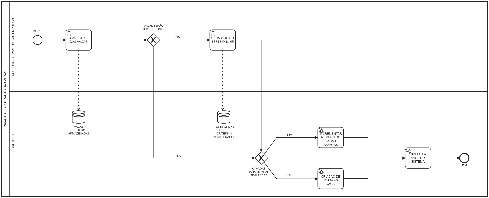
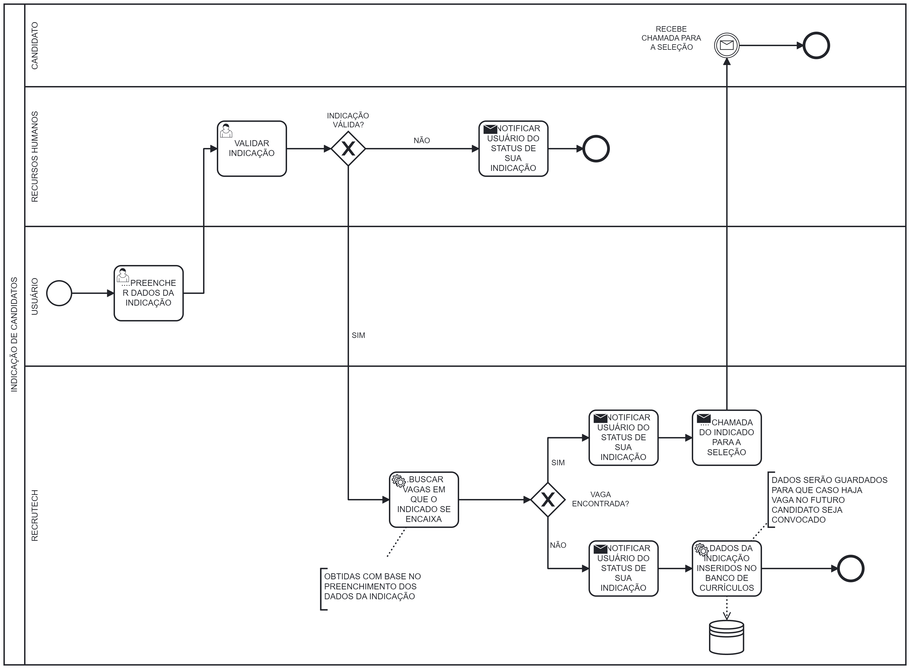

# RecruTech

**Barbara Mattioly Andrade, 1403413@sga.pucminas.br**

**Bruna Barbosa Portilho Bernardes, bbernardes@sga.pucminas.br**

**Bruno Pontes Duarte, bruno.duarte@sga.pucminas.br**

**Camilla Regina da Cruz, 1413041@sga.pucminas.br**

**Laura Enísia Rodrigues Melo, laura.enisia@sga.pucminas.br**

**Samuel Marques Sousa Leal, 1401791@sga.pucminas.br** 

---

Professores:

**Prof Cristiano Geraldo Teixeira Silva** 
**Prof. Felipe Augusto Lima Reis** 
**Prof. Hugo Bastos de Paula** 

---

_Curso de Engenharia de Software, Unidade Praça da Liberdade_

_Instituto de Informática e Ciências Exatas – Pontifícia Universidade de Minas Gerais (PUC MINAS), Belo Horizonte – MG – Brasil_

---

_**Resumo**. Escrever aqui o resumo. O resumo deve contextualizar rapidamente o trabalho, descrever seu objetivo e, ao final, 
mostrar algum resultado relevante do trabalho (até 10 linhas)._

---

## 1. Introdução

    1.1 Contextualização

Primordialmente, o trabalho é inserido no contexto dos processos realizados no setor de Recursos Humanos de empresas, com foco maior nas etapas de seleção de funcionários na rede corporativa. Nesse viés, é sabido no âmbito empresarial a necessidade de um processo de admissão bem pensado e estruturado, que contribui para um ambiente de colaboração e comunicação mais eficaz, além do consequente maior desempenho da companhia no mercado [1.1].  
Transitando o foco para a a contratação em si, as diversas etapas que compõem tal processo podem ser divididas em cinco majoritárias: divulgação da vaga, processo seletivo, contato final aos candidatos, a efetivação documentada e a integração com a equipe e o ambiente de trabalho. Por ser uma atividade regida pela CLT (Consolidação das Leis do Trabalho), os direitos e deveres de cada parte devem ser respeitados a todo momento, garantindo assim a segurança tanto do contratado quanto do contratante.  
Por fim, é fato que a recente pandemia trouxe a digitalização acelerada dos meios, tendo em vista a necessidade urgente da atualização de tecnologias; além disso, vagas de emprego na modalidade _home office_ tendem somente a crescer, especialmente nas áreas de Tecnologia da informação. Como consequência, torna-se imprescindível ter um setor de RH confiável e atualizado, trazendo segurança no quesito dos colabores à empresa em questão.

    1.2 Problema

Apesar de ser um setor tão importante na administração de uma organização, a execução de seus serviços não é feita da maneira mais eficiente possível. As questões mais trazidas à tona são o excesso de burocracia enfrentado pelas partes da gerência da empresa e do funcionário (o que é potencializado no período de contratação, onde deve haver a inserção e o armazenamento de diversos tipos de documentos diferentes) e justamente o controle de dados relevantes. Ainda nesse contexto, vale citar a dificuldade de manter a organização e eficiência armazenamento de documentação, tendo em vista o enorme volume de informações gerenciada pelo setor. Esse problema, quando somado à obsolescência de sistemas usados, ou pior ainda, o mantimento de processos manuais - quando poderiam ser feitos por meio de uma ferramenta específica -  pode causar um caos no setor, enfrentando a má comunicação e possíveis problemas jurídicos. Usualmente, isso acontece pela falta de investimento no setor tecnológico, visando o controle de gastos.  
Entretanto, somente o maior investimento no âmbito não é o suficiente para combater um problema tão profundo, é necessário também o treinamento para o uso dos recursos de maneira eficiente, e especialmente a padronização das tarefas feitas, para que haja coesão e entendimento conjunto entre os materiais de trabalho do departamento do RH [1.2].

    1.3 Objetivo geral

   
      Elaborar um sistema que faça para a empresa o processo seletivo de uma vaga de emprego ou estagio, envolvendo a criação da vaga, divulgação, inscrição, seleção, com todo o processo seletivo (fazer a entrevista, a atividade individual e a atividade em grupo) e por fim realizar a contratação ou não do candidato.

 
        1.3.1 Objetivos específicos 

   - Criar uma plataforma intuitiva que facilite a empresa interessada a contratar novos funcionarios. 
   - Criar a área do candidato, na qual o mesmo pode demonstrar interesse em participar do processo seletivo. 
   - Armazenar essas informações em um banco de dados. 

    1.4 Justificativas

Com a criação de uma plataforma intuitiva de recrutamento e seleção, o projeto tem a finalidade de automatizar os processos burocráticos no âmbito da contratação de funcionários em empresas, realizando a gerência de documentos. 
Irá fornecer um ambiente centralizado, padronizado e organizado no setor de recursos humanos.
Dessa forma, otimizará o tempo de execução de tarefas, facilitando o meio de trabalho dos funcionários.

## 2. Participantes do processo
Os Stakeholders do projeto são:
- Profissionais de RH (psicólogos, administradores, assistentes sociais e recrutadores)
- Empresas parceiras
- Diretor e supervisor da empresa
- Candidatos 

Os profissionais do RH, juntamente com os recrutadores, serão os indivíduos que participarão ativamente no Recrutech e em todas as etapas do processo seletivo. (Pessoas de 20-60 anos)
 
Os candidatos são as pessoas interessadas nas vagas estabelecidas no sistema, sendo de estágio, CLT, ou PJ. 
(Pessoas de 16-70 anos)

O diretor e supervisor da empresa são as pessoas que participarão de algumas etapas do processo seletivo (entrevistas) para analisarem os candidatos durante as etapas.
(Pessoas de 25-70 anos)

## 3. Modelagem do processo de negócio

## 3.1. Análise da situação atual

Os atuais processos do setor de recursos humanos (RH) contam com alguns pontos principais como controle de ponto, folhas de pagamento, armazenamento de dados, contratação e demissão.
Analisando o cenário atual, é nítido como esse setor apresenta desafios na execução desses processos, como a gestão de documentações, excesso de burocracias e informações, utilização de sistemas legados e entre outras dificuldades. Em muitas empresas, grande parte desses processos que poderiam ser automatizados são feitos de forma manual, aumentando a sobrecarga e dificultando a gerência do trabalho.

Como forma de entender melhor as dificuldades enfrentadas, realizamos pesquisas e conversamos com pessoas que trabalham nessa área, e algo que foi colocado em pauta é a dificuldade na gerência das documentações  por apresentar muitos funcionários, o trabalho para armazenar todos os documentos em uma pasta e fazer buscas nesses documentos é muito grande. A automatização desse processo facilitaria o acesso a informações mais antigas e que dificilmente seriam encontradas nos arquivos físicos da empresa. Oferecendo assim maior facilidade e rapidez nas buscas, além de segurança no arquivamento de dados importantes.

Hoje, o fechamento da folha de pagamento e o controle de ponto também são feitos em sua maioria de forma manual. As regras das folhas de pagamento, taxas e impostos que devem ser calculados abrem possibilidades para erros manuais, mas a automação e os softwares de gestão contribuem com os cálculos e adequam todos os pontos conforme a legislação trabalhista. Já o controle de ponto passa pela importância de saber da possibilidade de automação de processos de RH, uma vez que ao automatizar esse processo o cálculo de horas trabalhadas se torna mais preciso.

O processo de busca de funcionários que se encaixam nos requisitos da vaga ofertada pela empresa em grande parte de forma manual. Para encontrar candidatos para a vaga disponível na empresa, hoje é feita a divulgação em meios de comunicação e em portais, os candidatos enviam o seu currículo e a pessoa responsável do RH da empresa faz a análise de cada um desses currículos para encontrar um candidato que se encaixe na vaga, um processo honeroso e que poderia ser facilitado com a automação do processo de busca do candidato, sendo disponibilizado para o recrutador, apenas os currículos daquelas pessoas que se encaixam na vaga.

Dessa maneira, o recruTech busca trazer uma solução para tornar mais eficiente os processos de divulgação de vagas, contratação e efetivação de um funcionário proporcionando um ambiente centralizado e organizado para a gerência desses processos.

## 3.2. Descrição Geral da proposta

O processo em que a plataforma atua se inicia com a criação e divulgação da vaga com os requisitos desejados pela empresa. Após isso, os indivíduos interessados podem se candidatar à vaga de emprego, preenchendo formulários com informações pessoais e pertinentes à oferta, além do envio do currículo pessoal. Em seguida, o sistema filtra os candidatos com base nos requisitos especificados pelo setor de Recursos Humanos, disponibilizando ao departamento uma lista de possíveis convocados. Após o contato com aqueles candidatos dejesados, deve haver uma confirmação de interesse em continuar o processo seletivo. Caso contrário, ocorre a escolha de outro currículo.   
   
Dessa maneira, a seleção segue de acordo com as políticas da empresa em questão - entrevistas, provas ou contatos pessoais ocorrem nesse momento. Assim, a empresa contata cada candidato por meio do sistema, enviando e-mails quanto ao feedback do processo seletivo. Na etapa seguinte, ocorre o envio da documentação necessária por parte do candidato selecionado para a contratação ser efetivada, assim como a marcação do exame médico admissional e o respectivo contato com finalidade informativa ao novo prestador de serviços.

Por último, o setor do RH redige o contrato e o envia para a revisão de dados por parte do candidato, que após análise cuidadosa deve confirmá-lo ou mandá-lo de volta para a correção. Caso todo o processo seja bem-sucedido, o candidato é efetivamente contratado e catalogado no sistema corporativo.

Nesse viés, vale ressaltar que a atuação da plataforma RecruTech se dá pela filtragem primária dos candidatos e pelo contato contínuo entre as partes interessadas (profissionais do RH, candidatos e a administração da empresa). Com isso, há maior organização e agilidade no que tange o processo admissional.

Por fim, é importante manter as limitações do sistema em mente. Ainda nesse contexto, processos manuais como as entrevistas, aplicações de provas ou a assinatura do contrato por ambas as partes não poderão ser automatizados, tendo em vista a complexidade e necessidade da intervenção humana contínua nas etapas citadas.

## 3.3. Modelagem dos Processos

### 3.3.1 Processo 1 – Criação e divulgação das vagas

O primeiro processo se trata da criação e divulgação das vagas, o processo inicia-se com o setor do recursos humanos da empresa cadastrando as vagas com os requisitos desejados no sistema Recrutech. Logo em seguida é decidido pelo recursos humanos se haverá teste avaliativo online, e se sim, é realizado o cadastro do teste online no sistema do Recrutech. A partir daí se houver vagas cadastradas similares apenas incrementa o número de vagas, do contrário cria-se uma nova vaga. E é finalizado com a vaga sendo divulgada no sistema automaticamente.

### 3.3.2 Processo 2 – Inscrição do candidato na vaga

O segundo processo, é o processo de inscrição do candidato na vaga, o processo inicia-se com o candidato enviando o seu currículo e o sistema recrutech armazenando-o no banco de dados, após isso o sistema compara o currículo do candidato com os requisitos da vaga, caso as informações batam o candidato é chamado para a seleção, caso contrario o candidato não é selecionado para a vaga e é notifacadom, encerrando assim o processo. 

### 3.3.3 Processo 3 – Indicação de Candidatos pra uma vaga

**Descrição geral do processo:**

Processo responsável pela indicação de candidatos, onde o funcionário de uma empresa ou o usuário do sistema pode indicar um conhecido para alguma vaga, preenchendo alguns dados como o tempo que já trabalhou com essa pessoa, os motivos pelos quais a pessoa se encaixa na vaga em aberto, as competências e entre outros dados.

Caso a indicação seja validada e possua vagas em aberto em que a pessoa se encaixa, o usuário é notificado do resultado de sua indicação e a pessoa indicada é chamada para o processo seletivo, porém, caso não existam vagas abertas no sistema os dados da indicação são inseridos em um funil de indicações, para que, caso abra uma nova vaga em que a pessoa se encaixa, ela seja chamada. Se a indicação for recusada pelo responsável do RH, o processo é finalizado.

### 3.3.4 Processo 4 – Seleção

**Descrição geral do processo:**

O processo de seleção é o processo responsável pela apuração e triagem dos candidatos. Ele irá filtrar os candidatos de acordo com os currículos selecionados e as fases que terão no sistema como o teste online (caso a empresa exija) e a entrevista com o RH. 

O sistema Recrutech terá o banco de dados com os currículos pré-selecionados para as vagas e irá verificar se a vaga possui ou não um teste online. Caso não possua, o processo seguirá para a reunião entre o candidato e os Recursos Humanos. Caso possua, o sistema irá disponibilizar um teste online para os candidatos e prosseguir com a candidatura. 

De acordo com o resultado de cada fase o sistema envia uma mensagem de retorno notificando o usuário sobre o status do seu processo seletivo (se ele foi aprovado para a próxima etapa ou reprovado). Caso ele tenha sido reprovado em alguma fase o candidato automaticamente é desclassificado para a vaga proposta. E caso tenha sido aprovado em todas as etapas, o candidato é encaminhado para o processo de contratação.

### 3.3.5 Processo 5 – Contratação

**Descrição geral do processo:**

Processo de contratação, em que o inicio se dá pela comunicação ao candidato quanto ao feedback de seu processo seletivo. Logo em seguida, o sistema da RecruTech abre para o recebimento da devida documentação necessária para a redação do contrato por parte do setor do RH. Este, deve conferir a integridade dos documentos, assim como se estão completos, para que o processo seja levado adiante e o contratado possa revisar e assinar o contrato. Caso haja alguma inconstância nos dados contratuais, o mesmo é levado para a reelaboração. Caso esteja tudo nos conformes, o setor de recursos humanos das empresas recebe novamente o contrato final e solicita a carteira de trabalho ao contratado. Após isso, o processo tem fim com sua carteira de trabalho registrada pela administração do RH. Vale ressaltar que a empresa pode determinar um prazo para o envio das documentações e assinatura do contrato, em que caso o indivíduo não faça os passos necessários para a continuidade do processo ele é desclassificado e o processo termina.

### 3.3.6 Processo 6 – Cancelamento da Vaga pela empresa

**Descrição geral do processo:**

O processo de cancelamento de vagas por parte da empresa é responsável por receber a solicitação de cancelamento de vagas do setor de Recursos Humanos da empresa, é feito uma verificação de candidatos já registrados (contratados) para aquela vaga, casa já tenha sido registrado outra pessoa, o candidato é notificado com o feedback de indisponibilidade da vaga de interesse. O currículo do candidato é salvo no banco de dados da RecruTech e a vaga que antes estava disponível agora é removida do sistema. Caso a vaga não tenha nenhum candidato registrado,a vaga somente é removida a do sistema.

## 4. Projeto da Solução

### 4.1. Detalhamento das atividades

Descrever aqui cada uma das propriedades das atividades de cada um dos processos. Devem estar relacionadas com o modelo de processo apresentado anteriormente.

#### Processo 1 – CRIAÇÃO E DIVULGAÇÃO DAS VAGAS

**Cadastro das vagas**

| **Campo** | **Tipo** | **Restrições** | **Valor default** |
| --- | --- | --- | --- |
| Título da vaga | Área de texto | Máximo 50 caracteres |  |

| **Campo** | **Tipo** | **Restrições** | **Valor default** |
| --- | --- | --- | --- |
| Descrição da vaga | Área de texto |  | Sem descrição da vaga |

| **Campo** | **Tipo** | **Restrições** | **Valor default** |
| --- | --- | --- | --- |
| Restrições da vaga | Área de texto |  |  |

| **Campo** | **Tipo** | **Restrições** | **Valor default** |
| --- | --- | --- | --- |
| Requisitos da vaga | Lista |  |  |

| **Campo** | **Tipo** | **Restrições** | **Valor default** |
| --- | --- | --- | --- |
| Quantidade das vagas | Número | Valor maior que zero |  |

**Cadastro de teste online**

| **Campo** | **Tipo** | **Restrições** | **Valor default** |
| --- | --- | --- | --- |
| Envio do teste online | Arquivo | Formato PDF |  |

| **Campo** | **Tipo** | **Restrições** | **Valor default** |
| --- | --- | --- | --- |
| Nota mínima exigida no teste | Número |  |  |

#### Processo 2 – INSCRIÇÃO DO CANDIDATO NA VAGA

**Envio de curriculo**

| **Campo** | **Tipo** | **Restrições** | **Valor default** |
| --- | --- | --- | --- |
| Curriculo | Arquivo | Formato PDF |  |

#### Processo 5 – CONTRATAÇÃO

**Envio da documentação para a redação do contrato**

| **Campo** | **Tipo** | **Restrições** | **Valor default** |
| --- | --- | --- | --- |
| Documentos Pessoais | Arquivo | Pasta compactada |  |

**Envio do contrato e carteira de trabalho**

| **Campo** | **Tipo** | **Restrições** | **Valor default** |
| --- | --- | --- | --- |
| Contrato Assinado | Arquivo | Formato PDF |  |
| Carteira de Trabalho | Arquivo | Formato PDF |  |

### 4.2. Tecnologias

Descreva qual(is) tecnologias você vai usar para resolver o seu problema, ou seja implementar a sua solução. Liste todas as tecnologias envolvidas, linguagens a serem utilizadas, serviços web, frameworks, bibliotecas, IDEs de desenvolvimento, e ferramentas. Apresente também uma figura explicando como as tecnologias estão relacionadas ou como uma interação do usuário com o sistema vai ser conduzida, por onde ela passa até retornar uma resposta ao usuário.

## 5. Modelo de dados

Apresente o modelo de dados por meio de um modelo relacional ou Diagrama de Entidade-Relacionamento (DER) que contemple todos conceitos e atributos apresentados item anterior. 

## 6. Indicadores de desempenho

Apresente aqui os principais indicadores de desempenho e algumas metas para o processo. Atenção: as informações necessárias para gerar os indicadores devem estar contempladas no diagrama de classe. Colocar no mínimo 5 indicadores.

Usar o seguinte modelo:

| **Indicador** | **Objetivos** | **Descrição** | **Cálculo** | **Fonte dados** | **Perspectiva** |
| --- | --- | --- | --- | --- | --- |
| Percentual reclamações | Avaliar quantitativamente as reclamações | Percentual de reclamações em relação ao total atendimento |   | Tabela reclamações | Aprendizado e Crescimento |
| Taxa de Requisições abertas | Melhorar a prestação de serviços medindo a porcentagem de requisições | Mede % de requisições atendidas na semana |  | Tabela solicitações | Processos internos |
| Taxa de entrega de material | Manter controle sobre os materiais que estão sendo entregues | Mede % de material entregue dentro do mês |   | Tabela Pedidos | Clientes |

Obs.: todas as informações para gerar os indicadores devem estar no diagrama de classe **a ser proposto**

## 7.Sistema desenvolvido

Faça aqui uma breve descrição do software e coloque as principais telas com uma explicação de como usar cada uma.

## 8. Conclusão

Apresente aqui a conclusão do seu trabalho. Discussão dos resultados obtidos no trabalho, onde se verifica as observações pessoais de cada aluno. Poderá também apresentar sugestões de novas linhas de estudo.

# REFERÊNCIAS

<!--Como um projeto de software não requer revisão bibliográfica, a inclusão das referências não é obrigatória. No entanto, caso você deseje incluir referências relacionadas às tecnologias, padrões, ou metodologias que serão usadas no seu trabalho, relacione-as de acordo com a ABNT.

Verifique no link abaixo como devem ser as referências no padrão ABNT:

http://www.pucminas.br/imagedb/documento/DOC\_DSC\_NOME\_ARQUI20160217102425.pdf -->

**[1.1]** - [GUIA] Processo de admissão: Etapas, prazos e passo a passo, PontoTel, 2021. Disponível em https://www.pontotel.com.br/processo-de-admissao/. Acesso em 21/08/2022

**[1.2]** - ARAÚJO, Marcelo. Conheça 9 principais problemas no setor de RH, eBOX, 2019. Disponível em https://www.eboxdigital.com.br/blog/conheca-4-principais-problemas-no-setor-de-rh#:~:text=Excesso%20de%20burocracia,conhecido%20como%20um%20setor%20burocrático. Acesso em 21/08/2022

<!--/***[1.3]** - _CORMEN, Thomas H. et al. **Algoritmos: teoria e prática**. Rio de Janeiro, RJ: Elsevier, Campus, c2012. xvi, 926 p. ISBN 9788535236996._

**[1.4]** - _SUTHERLAND, Jeffrey Victor. **Scrum: a arte de fazer o dobro do trabalho na metade do tempo**. 2. ed. rev. São Paulo, SP: Leya, 2016. 236, [4] p. ISBN 9788544104514._

**[1.5]** - _RUSSELL, Stuart J.; NORVIG, Peter. **Inteligência artificial**. Rio de Janeiro: Elsevier, c2013. xxi, 988 p. ISBN 9788535237016._-->

# APÊNDICES

**Colocar link:**

Do código (armazenado no repositório);

Dos artefatos (armazenado do repositório);

Da apresentação final (armazenado no repositório);

Do vídeo de apresentação (armazenado no repositório).

