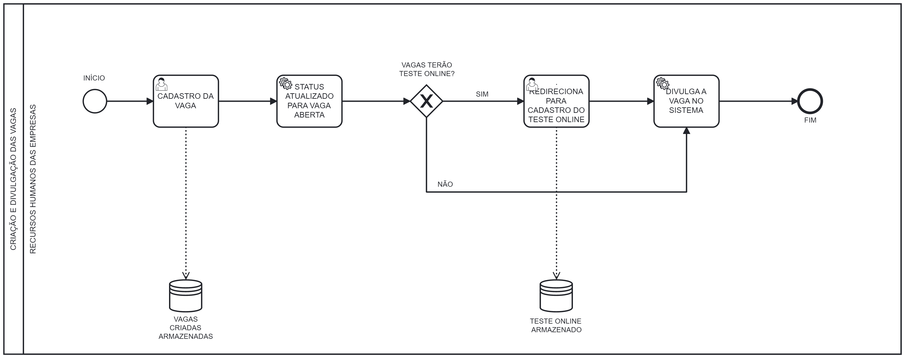
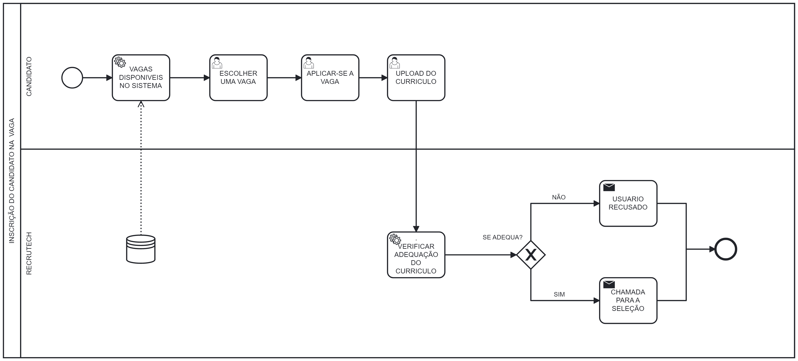
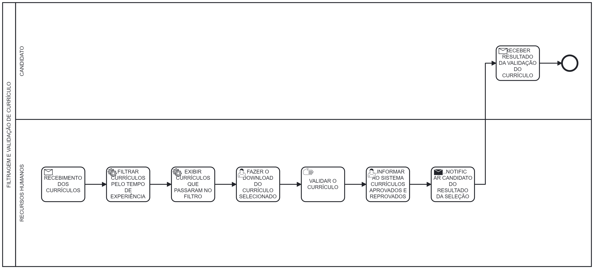
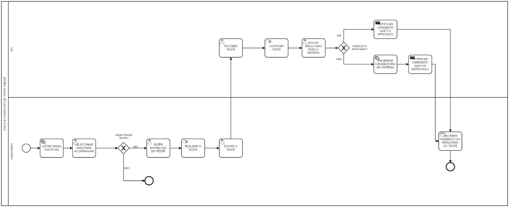
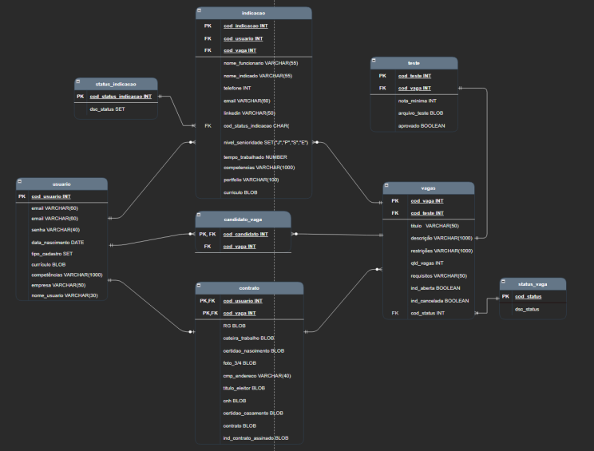

# RecruTech

**Barbara Mattioly Andrade, 1403413@sga.pucminas.br**

**Bruna Barbosa Portilho Bernardes, bbernardes@sga.pucminas.br**

**Bruno Pontes Duarte, bruno.duarte@sga.pucminas.br**

**Camilla Regina da Cruz, 1413041@sga.pucminas.br**

**Laura Enísia Rodrigues Melo, laura.enisia@sga.pucminas.br**

**Samuel Marques Sousa Leal, 1401791@sga.pucminas.br** 

---

Professores:

**Prof Cristiano Neves Rodrigues** 
**Prof. Felipe Augusto Lima Reis** 
**Prof. Hugo Bastos de Paula** 

---

_Curso de Engenharia de Software, Unidade Praça da Liberdade_

_Instituto de Informática e Ciências Exatas – Pontifícia Universidade de Minas Gerais (PUC MINAS), Belo Horizonte – MG – Brasil_

---

**Resumo** 
No contexto de processos realizados no setor de Recursos Humanos de empresas, com foco maior nas etapas de seleção de funcionários na rede corporativa é notório que a maioria das empresas possuem processos extremamente burocráticos e tradicionais: envio e cadastro de documentos manualmente, dificuldade no controle e administração de dados e documentos e a demora de feedbacks das etapas do processo seletivo. Desse modo, o objetivo do trabalho consiste em desenvolver um sistema afim de solucionar esses problemas agilizando o processo de seleção e de contratação. Essa plataforma contará com feedbacks para os candidatos e gerência de informações, além de conter indicadores que evidenciam a taxa de usuários, taxa de vagas criadas, indíce de contratação e outros quantitativos. Com a criação de uma plataforma intuitiva de recrutamento e seleção, o projeto irá fornecer um ambiente centralizado, padronizado e organizado no setor de recursos humanos. Dessa forma, otimizará o tempo de execução de tarefas, facilitando o meio de trabalho dos funcionários.

---

## 1. Introdução

    1.1 Contextualização

Primordialmente, o trabalho é inserido no contexto dos processos realizados no setor de Recursos Humanos de empresas, com foco maior nas etapas de seleção de funcionários na rede corporativa. Nesse viés, é sabido no âmbito empresarial a necessidade de um processo de admissão bem pensado e estruturado, que contribui para um ambiente de colaboração e comunicação mais eficaz, além do consequente maior desempenho da companhia no mercado [1.1].  
Transitando o foco para a a contratação em si, as diversas etapas que compõem tal processo podem ser divididas em cinco majoritárias: divulgação da vaga, processo seletivo, contato final aos candidatos, a efetivação documentada e a integração com a equipe e o ambiente de trabalho. Por ser uma atividade regida pela CLT (Consolidação das Leis do Trabalho), os direitos e deveres de cada parte devem ser respeitados a todo momento, garantindo assim a segurança tanto do contratado quanto do contratante.  
Por fim, é fato que a recente pandemia trouxe a digitalização acelerada dos meios, tendo em vista a necessidade urgente da atualização de tecnologias; além disso, vagas de emprego na modalidade _home office_ tendem somente a crescer, especialmente nas áreas de Tecnologia da informação. Como consequência, torna-se imprescindível ter um setor de RH confiável e atualizado, trazendo segurança no quesito dos colabores à empresa em questão.

    1.2 Problema

Apesar de ser um setor tão importante na administração de uma organização, a execução de seus serviços não é feita da maneira mais eficiente possível. As questões mais trazidas à tona são o excesso de burocracia enfrentado pelas partes da gerência da empresa e do funcionário (o que é potencializado no período de contratação, onde deve haver a inserção e o armazenamento de diversos tipos de documentos diferentes) e justamente o controle de dados relevantes. Ainda nesse contexto, vale citar a dificuldade de manter a organização e eficiência armazenamento de documentação, tendo em vista o enorme volume de informações gerenciada pelo setor. Esse problema, quando somado à obsolescência de sistemas usados, ou pior ainda, o mantimento de processos manuais - quando poderiam ser feitos por meio de uma ferramenta específica -  pode causar um caos no setor, enfrentando a má comunicação e possíveis problemas jurídicos. Usualmente, isso acontece pela falta de investimento no setor tecnológico, visando o controle de gastos.  
Entretanto, somente o maior investimento no âmbito não é o suficiente para combater um problema tão profundo, é necessário também o treinamento para o uso dos recursos de maneira eficiente, e especialmente a padronização das tarefas feitas, para que haja coesão e entendimento conjunto entre os materiais de trabalho do departamento do RH [1.2].

    1.3 Objetivo geral

   
      Elaborar um sistema que faça para a empresa o processo seletivo de uma vaga de emprego ou estagio, envolvendo a criação da vaga, divulgação, inscrição, seleção, com todo o processo seletivo (fazer a entrevista, a atividade individual e a atividade em grupo) e por fim realizar a contratação ou não do candidato.

 
        1.3.1 Objetivos específicos 

   - Criar uma plataforma intuitiva que facilite a empresa interessada a contratar novos funcionarios. 
   - Criar a área do candidato, na qual o mesmo pode demonstrar interesse em participar do processo seletivo. 
   - Armazenar essas informações em um banco de dados. 

    1.4 Justificativas

Com a criação de uma plataforma intuitiva de recrutamento e seleção, o projeto tem a finalidade de automatizar os processos burocráticos no âmbito da contratação de funcionários em empresas, realizando a gerência de documentos. 
Irá fornecer um ambiente centralizado, padronizado e organizado no setor de recursos humanos.
Dessa forma, otimizará o tempo de execução de tarefas, facilitando o meio de trabalho dos funcionários.

## 2. Participantes do processo
Os Stakeholders do projeto são:
- Profissionais de RH (psicólogos, administradores, assistentes sociais e recrutadores)
- Empresas parceiras
- Diretor e supervisor da empresa
- Candidatos 

Os profissionais do RH, juntamente com os recrutadores, serão os indivíduos que participarão ativamente no Recrutech e em todas as etapas do processo seletivo. (Pessoas de 20-60 anos)
 
Os candidatos são as pessoas interessadas nas vagas estabelecidas no sistema, sendo de estágio, CLT, ou PJ. 
(Pessoas de 16-70 anos)

O diretor e supervisor da empresa são as pessoas que participarão de algumas etapas do processo seletivo (entrevistas) para analisarem os candidatos durante as etapas.
(Pessoas de 25-70 anos)

## 3. Modelagem do processo de negócio

## 3.1. Análise da situação atual

Os atuais processos do setor de recursos humanos (RH) contam com alguns pontos principais como controle de ponto, folhas de pagamento, armazenamento de dados, contratação e demissão.
Analisando o cenário atual, é nítido como esse setor apresenta desafios na execução desses processos, como a gestão de documentações, excesso de burocracias e informações, utilização de sistemas legados e entre outras dificuldades. Em muitas empresas, grande parte desses processos que poderiam ser automatizados são feitos de forma manual, aumentando a sobrecarga e dificultando a gerência do trabalho.

Como forma de entender melhor as dificuldades enfrentadas, realizamos pesquisas e conversamos com pessoas que trabalham nessa área, e algo que foi colocado em pauta é a dificuldade na gerência das documentações  por apresentar muitos funcionários, o trabalho para armazenar todos os documentos em uma pasta e fazer buscas nesses documentos é muito grande. A automatização desse processo facilitaria o acesso a informações mais antigas e que dificilmente seriam encontradas nos arquivos físicos da empresa. Oferecendo assim maior facilidade e rapidez nas buscas, além de segurança no arquivamento de dados importantes.

Hoje, o fechamento da folha de pagamento e o controle de ponto também são feitos em sua maioria de forma manual. As regras das folhas de pagamento, taxas e impostos que devem ser calculados abrem possibilidades para erros manuais, mas a automação e os softwares de gestão contribuem com os cálculos e adequam todos os pontos conforme a legislação trabalhista. Já o controle de ponto passa pela importância de saber da possibilidade de automação de processos de RH, uma vez que ao automatizar esse processo o cálculo de horas trabalhadas se torna mais preciso.

O processo de busca de funcionários que se encaixam nos requisitos da vaga ofertada pela empresa em grande parte de forma manual. Para encontrar candidatos para a vaga disponível na empresa, hoje é feita a divulgação em meios de comunicação e em portais, os candidatos enviam o seu currículo e a pessoa responsável do RH da empresa faz a análise de cada um desses currículos para encontrar um candidato que se encaixe na vaga, um processo honeroso e que poderia ser facilitado com a automação do processo de busca do candidato, sendo disponibilizado para o recrutador, apenas os currículos daquelas pessoas que se encaixam na vaga.

Dessa maneira, o recruTech busca trazer uma solução para tornar mais eficiente os processos de divulgação de vagas, contratação e efetivação de um funcionário proporcionando um ambiente centralizado e organizado para a gerência desses processos.

## 3.2. Descrição Geral da proposta

O processo em que a plataforma atua se inicia com a criação e divulgação da vaga com os requisitos desejados pela empresa. Após isso, os indivíduos interessados podem se candidatar à vaga de emprego, preenchendo formulários com informações pessoais e pertinentes à oferta, além do envio do currículo pessoal. Em seguida, o sistema filtra os candidatos com base nos requisitos especificados pelo setor de Recursos Humanos, disponibilizando ao departamento uma lista de possíveis convocados. Após o contato com aqueles candidatos dejesados, deve haver uma confirmação de interesse em continuar o processo seletivo. Caso contrário, ocorre a escolha de outro currículo.   
   
Dessa maneira, a seleção segue de acordo com as políticas da empresa em questão - entrevistas, provas ou contatos pessoais ocorrem nesse momento. Assim, a empresa contata cada candidato por meio do sistema, enviando e-mails quanto ao feedback do processo seletivo. Na etapa seguinte, ocorre o envio da documentação necessária por parte do candidato selecionado para a contratação ser efetivada, assim como a marcação do exame médico admissional e o respectivo contato com finalidade informativa ao novo prestador de serviços.

Por último, o setor do RH redige o contrato e o envia para a revisão de dados por parte do candidato, que após análise cuidadosa deve confirmá-lo ou mandá-lo de volta para a correção. Caso todo o processo seja bem-sucedido, o candidato é efetivamente contratado e catalogado no sistema corporativo.

Nesse viés, vale ressaltar que a atuação da plataforma RecruTech se dá pela filtragem primária dos candidatos e pelo contato contínuo entre as partes interessadas (profissionais do RH, candidatos e a administração da empresa). Com isso, há maior organização e agilidade no que tange o processo admissional.

Por fim, é importante manter as limitações do sistema em mente. Ainda nesse contexto, processos manuais como as entrevistas, aplicações de provas ou a assinatura do contrato por ambas as partes não poderão ser automatizados, tendo em vista a complexidade e necessidade da intervenção humana contínua nas etapas citadas.

## 3.3. Modelagem dos Processos

### 3.3.1 Processo 1 – Criação e divulgação das vagas

O primeiro processo se trata da criação e divulgação das vagas, o processo inicia-se com o setor do recursos humanos da empresa cadastrando as vagas com os requisitos desejados no sistema Recrutech, elas ficam armazenadas no banco de dados do sistema. Logo em seguida o sistema atualiza o status da vaga para vaga aberta. E é decidido pelo recursos humanos se haverá teste avaliativo online, se sim, é redirecionado para o cadastro do teste online no sistema do Recrutech, e da mesma forma ele é armazenado no banco de dados do sistema. Em seguida a vaga é divulgada no sistema, e caso não tenha teste avaliativo online finaliza-se com a vaga sem teste sendo divulgada no sistema.

### 3.3.2 Processo 2 – Inscrição do candidato na vaga

O segundo processo, é o processo de inscrição do candidato na vaga, o processo inicia-se com o candidato visualizando as vagas disponíveis no sistema que estão armazenadas no banco de dados. A partir daí ele escolhe uma vaga que lhe agrada, abre a tela de detalhes que consta os critérios da vaga escolhida. Dessa forma ele aplica-se na vaga e finaliza fazendo o upload de seu currículo.

### 3.3.3 Processo 3 – Filtragem e Validação de Currículos

**Descrição geral do processo:**

Processo responsável pela filtragem automática de currículos por meio do tempo de experiência requisitado pela vaga e o informado pelo candidato, e pela validação manual dos currículos filtrados pelo profissional de recursos humanos.

### 3.3.4 Processo 4 – Seleção do Candidato (Teste)

**Descrição geral do processo:**

O processo de seleção é o processo responsável pelo envio e correção do teste online. Inicia-se com a tela contendo a lista de vagas inscritas disponibilizada para o candidato. Logo em seguida ele seleciona uma vaga para acompanhar, se a vaga possuir teste o candidato faz o download do teste, realiza o teste e envia para o RH da empresa. A partir daí o RH da empresa corrige o teste manualmente e envia o resultado para o sistema Recrutech. Se o candidato foi aprovado é enviado um email notificando-o da aprovação, caso contrário a candidatura é encerrada no sistema e o candidato é notificado que infelizmente foi reprovado no processo seletivo. 	

### 3.3.5 Processo 5 – Seleção do Candidato (Entrevista)

**Descrição geral do processo:**

O processo 5 é a continuação da seleção do candidato que inicia-se com o RH da empresa notificando os candidatos aprovados com informações e o link da entrevista. Em seguida após aguardar a conclusão da entrevista, o RH da empresa informa ao sistema o resultado, e se o canditato for aprovado é enviado um email notificando os próximos passos com informações de contratação. Com isso, o sistema atualiza o status da vaga para "fechada". Caso o candidato não foi aprovado na entrevista ele é notificado com o feedback da mesma, contendo a informação que infelizmente ele foi reprovado no processo seletivo.

### 3.3.6 Processo 6 – Cancelamento da Vaga pela empresa

**Descrição geral do processo:**

O processo de cancelamento de vagas por parte da empresa é responsável por receber a solicitação de cancelamento de vagas do setor de Recursos Humanos da empresa, é feito uma verificação de candidatos já registrados (contratados) para aquela vaga, casa já tenha sido registrado outra pessoa, o candidato é notificado com o feedback de indisponibilidade da vaga de interesse. O currículo do candidato é salvo no banco de dados da RecruTech e a vaga que antes estava disponível agora é removida do sistema. Caso a vaga não tenha nenhum candidato registrado,a vaga somente é removida a do sistema.

## 4. Projeto da Solução

### 4.1. Detalhamento das atividades

#### Processo 1 – CRIAÇÃO E DIVULGAÇÃO DAS VAGAS

**Cadastro das vagas**

| **Campo** | **Tipo** | **Restrições** | **Valor default** |
| --- | --- | --- | --- |
| Título da vaga | Caixa de texto | Máximo 50 caracteres |  |
| Descrição da vaga | Área de texto |  | Sem descrição da vaga |
| Local/Modalidade | Caixa de texto |  |  |
| Requisitos da vaga | Área de texto |  |  |
| Quantidade das vagas | Número | Valor maior que zero |  |
| Experiência mínima desejada | Número |  | Zero |
| Senioridade desejada | Radio |  |  |
| Possui teste | Radio |  | Null |

**Cadastro de teste online**

| **Campo** | **Tipo** | **Restrições** | **Valor default** |
| --- | --- | --- | --- |
| Envio do teste online | Arquivo | Formato PDF |  |

**Status da vaga**
| **Etapa** | **Cor representada** | **Texto** |
| --- | --- | --- |
| 1° | Vermelho | Vaga fechada | 
| 2° |  Verde | Vaga aberta |  

#### Processo 2 – INSCRIÇÃO DO CANDIDATO NA VAGA

**Lista Vagas**

| **Vaga** | **Local** | **Status** | **Detalhamento**
| --- | --- | --- | --- |
| Nome da vaga | Local/Modalidade | Aberta/Fechada | Botão para redirecionamento para a tela de detalhes |

**Detalhes**

| **Título** | **Subtítulo** | **Descrição** | **Inscrição** |
| --- | --- | --- | --- |
| Título da vaga e local | Empresa e presença de teste na vaga | Descrição da vaga|  Botão de inscrição (redirecionamento para o envio de currículo) |

**Envio de curriculo**

| **Campo** | **Tipo** | **Restrições** | **Valor default** |
| --- | --- | --- | --- |
| Curriculo | Arquivo | Formato PDF |  |

#### Processo 3 – INDICAÇÃO DE CANDIDATOS PARA UMA VAGA

**Preenchimento do formulário de inscrição**

| **Campo** | **Tipo** | **Restrições** | **Valor default** |
| --- | --- | --- | --- |
| Nome Funcionário | Caixa de Texto | Mínimo de 3 e máximo de 100 caracteres | - |
| Nome do indicado | Caixa de Texto | Mínimo de 3 e máximo de máximo 100 caracteres | - |
| Telefone do indicado | Caixa de Texto | Mínimo de 7 e máximo de 10 caracteres | - |
| E-mail do indicado | Caixa de Texto | Mínimo de 3 e máximo 100 caracteres | - |
| LinkedIn do indicado | Caixa de Texto | Máximo 100 caracteres | Nulo |
| Portfólio do indicado | Caixa de Texto | Máximo 100 caracteres | Nulo |
| Nível de senioridade | Radio | Não nulo | - |
| Tempo que conhece o indicado | Número | Maior que 1 ano | - |
| Competências do indicado | Lista | - | - |
| Currículo do indicado | Arquivo | Formato PDF | Não nulo |

**Status Indicação**
| **Campo** | **Tipo** | **Restrições** | **Valor default** |
| --- | --- | --- | --- |
| cod_status_indicacao | Número | Não Nulo | - |
| dsc_status_indicacao | Caixa de Texto | Não Nulo | - |

**Obs:**
Status da indicação
| **cod_status_indicacao** | **dsc_status_indicacao** |
| --- | --- |
| 1 | Em validação | 
| 2 | Validada | 
| 3 | Candidato Convocado para Seleção |
| 4 | Inserida no Banco de Indicações | 
| 5 | Indeferida | 
| 6 | Concluída | 

**Validação inscrição**

| **Campo** | **Tipo** | **Restrições** | **Valor default** |
| --- | --- | --- | --- |
| indicadorInscricaoVálida | Boolean | - | - |

#### Processo 4 – SELEÇÃO DO CANDIDATO

**Currículo**

| **Título** | **Subtitulo** | **Restrição** | **Restrição**|
| --- | --- | --- | --- |
| Nome da vaga | Nome da empresa | Tempo da vaga disponibilizada | PDF |

**Vaga**

| **Título** | **Subtitulo** | **Descrição** | **Contém teste** | **Etapa reunião** |
| --- | --- | --- | --- | --- |
| Nome da vaga| Nome da empresa| Detalhes da vaga | Boolean | Boolean |

**Teste**

| **Campo** | **Tipo** | **Restrições** | **Inicio**| **Fim** |
| --- | --- | --- | --- | --- |
| Teste online | Arquivo | PDF | Timer | Timer | 

**Avaliação do teste**

| **Título** | **Subtitulo** | **Teste recebido** | **Avaliação**| **Fim** |
| --- | --- | --- | --- | --- |
| Nome da vaga | Nome da empresa | Respostas do teste | Boa, neutra, ruim | Boolean | 

**Resultado do teste** 

| **Campo** | **Tipo** | **Restrições** | **Valor default** |
| --- | --- | --- | --- |
| Teste online | Arquivo | PDF | - |
| Resultado do teste | float | Máximo 5 caracteres | - |

**Status da seleção**

| **Título** | **Etapa** | 
| --- | --- |
| Nome da vaga Etapas bloqueadas e liberadas|

#### Processo 5 – CONTRATAÇÃO

**Envio da documentação pessoal para a redação do contrato**

| **Campo** | **Tipo** | **Restrições** | **Valor default** | **Obrigatório** | 
| --- | --- | --- | --- | --- |
| RG | Arquivo | Formato PDF | | Sim |
| Carteira de Trabalho | Arquivo | Formato PDF | | Sim |
| Certidão de Nascimento | Arquivo | Formato PDF | | Sim |
| Foto 3x4 | Arquivo | Formato PDF, JPG ou PNG | | Sim |
| Comprovante de Endereço | Arquivo | Formato PDF | | Sim |
| Cartão de Vacina | Arquivo | Formato PDF | | Não |
| Título de Eleitor| Arquivo | Formato PDF | | Sim |
| CNH | Arquivo | Formato PDF | | Não |
| Certidão de Casamento | Arquivo | Formato PDF | | Não |

**Envio do contrato para assinatura**

| **Campo** | **Tipo** | **Restrições** | **Valor default** |
| --- | --- | --- | --- |
| Contrato | Arquivo | Formato PDF |  |

**Envio do contrato assinado**

| **Campo** | **Tipo** | **Restrições** | **Valor default** |
| --- | --- | --- | --- |
| Contrato Assinado | Arquivo | Formato PDF |  |

#### Processo 6 – CANCELAMENTO DA VAGA PELA EMPRESA

**Vaga Cancelada**

| **Campo** | **Tipo** | **Restrições** | **Valor default** |
| --- | --- | --- | --- |
| Vaga cancelada | Booleano | - | False |

### 4.2. Tecnologias

As tecnologias utilizadas são, Node.js para o BackEnd, HTML/CSS/JavaScript no FrontEnd, MySQL para o SGBD, Visual Studio Code, Github e Figma.

## 5. Modelo de dados

por aq o entidade relaicoanmentoooo!!!!
=======
>>>>>>> afaf57934b85c95fb248dd8b29d953e1ac0f6796
## 6. Indicadores de desempenho

Apresente aqui os principais indicadores de desempenho e algumas metas para o processo. Atenção: as informações necessárias para gerar os indicadores devem estar contempladas no diagrama de classe. Colocar no mínimo 5 indicadores.

Usar o seguinte modelo:

| **Indicador** | **Objetivos** | **Descrição** | **Cálculo** | **Fonte dados** | **Perspectiva** |
| --- | --- | --- | --- | --- | --- |
| Taxa de usuários (mensais) | Avaliar quantitativamente a taxa de novos usuários cadastrados na plataforma por mês | Taxa de usuários cadastrados por mês |  (Somatório de usuários cadastrados no mês / Somatório total de usuários) | Tabela usuários | Análise do Crescimento da plataforma |
| Taxa de vagas criadas (mensais) | Avaliar quantitativamente a taxa de vagas cadastradas na plataforma pela empresa mensalmente| Quantitativo de vagas cadastradas por mês |  (Somatório de vagas cadastrados no mês / Somatório total de vagas) | Tabela vagas | Análise do Crescimento da plataforma |
| Taxa de vagas canceladas (mensais) | Avaliar quantitativamente a taxa de vagas canceladas na plataforma pela empresa mensalmente | Quantitativo de vagas canceladas por mês |  (Somatório de vagas canceladas no mês / Somatório total de vagas)*100 | Tabela vagas | Análise do Crescimento da plataforma |
| Índice de Contratação | Avaliar quantitativamente a taxa de usuários contratados na plataforma em relação a taxa de usuários inscritos na vaga | Taxa de usuários contratados por mês | (Somatório de pessoas inscritas na vaga / somatório de pessoas contratadas)*100 | Tabela vagas | Análise do Crescimento da plataforma |
| Quantidade de usuários ativos | Avaliar quantitativamente a quantidade de usuários que fazem uso da plataforma | Número de usuários cadastrados no sistema | (somatório de usuários logados) | Log da tabela de usuários | Análise da quantidade de usuários mensais do Recrutech |

## 7.Sistema desenvolvido

Faça aqui uma breve descrição do software e coloque as principais telas com uma explicação de como usar cada uma.

## 8. Conclusão

Os resultados obtidos do sistema foram satisfatórios. Apresenta um software fundamentado de acordo com os requisitos proposto no início do projeto. Ele conta com indicadores que são artefatos imprescindíveis para a empresa obter resultados sobre seus processos seletivos. Isso permite comparações de índices e taxas entre os meses, para que a empresa fique ciente dos seus resultados alcançados. 
Para implementações futuras, o sistema contará com processos de envio de documentos para a contratação de modo automatizado. Ele salvará os dados e documentos dos usuários diretamente na nuvem. Além disso, o sistema também enviará e-mails instâneos para o candidato sobre o resultado de cada etapa do processo seletivo e de contratação. 

# REFERÊNCIAS

<!--Como um projeto de software não requer revisão bibliográfica, a inclusão das referências não é obrigatória. No entanto, caso você deseje incluir referências relacionadas às tecnologias, padrões, ou metodologias que serão usadas no seu trabalho, relacione-as de acordo com a ABNT.

Verifique no link abaixo como devem ser as referências no padrão ABNT:

http://www.pucminas.br/imagedb/documento/DOC\_DSC\_NOME\_ARQUI20160217102425.pdf -->

**[1.1]** - [GUIA] Processo de admissão: Etapas, prazos e passo a passo, PontoTel, 2021. Disponível em https://www.pontotel.com.br/processo-de-admissao/. Acesso em 21/08/2022

**[1.2]** - ARAÚJO, Marcelo. Conheça 9 principais problemas no setor de RH, eBOX, 2019. Disponível em https://www.eboxdigital.com.br/blog/conheca-4-principais-problemas-no-setor-de-rh#:~:text=Excesso%20de%20burocracia,conhecido%20como%20um%20setor%20burocrático. Acesso em 21/08/2022

<!--/***[1.3]** - _CORMEN, Thomas H. et al. **Algoritmos: teoria e prática**. Rio de Janeiro, RJ: Elsevier, Campus, c2012. xvi, 926 p. ISBN 9788535236996._

**[1.4]** - _SUTHERLAND, Jeffrey Victor. **Scrum: a arte de fazer o dobro do trabalho na metade do tempo**. 2. ed. rev. São Paulo, SP: Leya, 2016. 236, [4] p. ISBN 9788544104514._

**[1.5]** - _RUSSELL, Stuart J.; NORVIG, Peter. **Inteligência artificial**. Rio de Janeiro: Elsevier, c2013. xxi, 988 p. ISBN 9788535237016._-->

# APÊNDICES

**Colocar link:**

- Código: (armazenado no repositório):

- Artefatos: https://github.com/ICEI-PUC-Minas-PPLES-TI/plf-es-2022-2-ti2-0924100-recrutech/tree/master/Artefatos

- Apresentação final: https://github.com/ICEI-PUC-Minas-PPLES-TI/plf-es-2022-2-ti2-0924100-recrutech/blob/master/divulgacao/Apresentacao/Apresentacao_final_RecruTech.pdf

- Vídeo de apresentação (armazenado no repositório):

